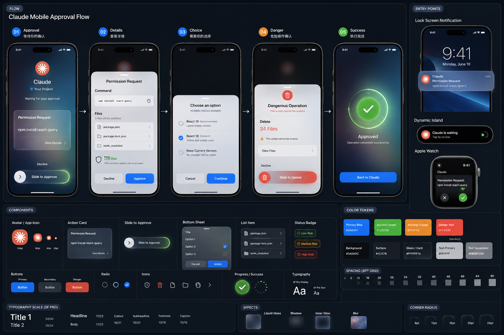

# 更新日志

本项目遵循 [Keep a Changelog](https://keepachangelog.com/zh-CN/1.1.0/) 规范，版本号遵循 [语义化版本](https://semver.org/lang/zh-CN/)。

## [Unreleased]

## [2.2.0] - 2026-07-28

### 新增

- **倒计时功能** - 齿轮设置面板设分钟数 + 开始/停止；启动后灯体直接显示倒计时数字（不再渲染红绿灯），单灯/三灯模式自适应字号
  - 设定 N 分钟从 N-1:59 开始倒数；归零后继续负数倒计时（超时计时，红色），直到手动停止
  - 归零瞬间触发系统通知 + 三声蜂鸣提醒（尊重静音开关）
- 齿轮设置面板新增「单灯模式」开关（ON=三灯 / OFF=单灯），与托盘菜单样式切换同步
- 应用启动默认亮稳定绿灯（就绪态），无动画最省 CPU
- **手机推送（Bark）+ 远程回传** - Claude 亮黄灯时推送到手机并可远程敲键回应
  - 设置「📱 手机推送（Bark）」：填 key 即启用，支持保存+测试推送到手机/手表
  - 滑动批准：glass 深色控制页，滑动条带流动极光光带，拖到 70% 变绿触发回车确认
  - 拒绝 / 其他回应（同意 y、输入文字）供 AskUserQuestion 等场景使用
  - 点「权限请求」卡片可切到电脑对应项目窗口
  - 本地 HTTP 服务（零依赖，nodenv 随机 token 鉴权），支持 macOS keystroke / Windows SendKeys 敲键注入
  - scroll 自适配（100dvh 无滚动条），Bark 推送通知带局域网控制页直链
- **Hook 抓取确认内容** - 新增 `hook_capture.cjs`，黄灯时读 Claude stdin JSON 提取待确认内容（命令/问题/文件路径），写入 `.prompt` 文件供推送与控制页展示
  - 控制页卡片展示真实内容（如 `$ npm install`），最多 3 行超出省略号，无内容时兜底占位

### 优化

- 闪烁光环动画从 `box-shadow` 改为 `transform: scale()` + `opacity`，转入 GPU 合成线程；黄灯动画态 Renderer CPU 从 ~24% 降至 ~6%、GPU 从 ~15% 降至 ~7%
- 余额光环加粗到 4px、底色加深（深色 0.5 / 浅色 0.35），progress 前端渐变到黑色形成进度头边线
- 余额文字加半透明背景 pill，浅色桌面下可读；修复 quota 三段式文字换行

### 变更

- 扩散环（闪烁光环）视觉柔化：缩小扩散范围、`box-shadow` 加 blur 软化硬边

### 文档

- 控制页 UI 设计稿 + glass 深色参考 (claude_mobile_glass.html)

## [2.1.3] - 2026-07-15

### 新增

- **多供应商余额/用量查询** - 余额光环从 DeepSeek + 火山 Ark 两个扩展到 10 个大模型供应商
  - 按量付费余额（金额类）：DeepSeek、阶跃星辰、硅基流动、OpenRouter、Novita AI，只需 API Key
  - Coding Plan 用量（百分比类）：火山 Ark、Kimi For Coding、智谱 GLM、MiniMax、ZenMux，展示 5h / 周 / 月配额百分比与重置时间
  - 设置页「大模型余额查询设置」改为下拉切换，凭证字段与「获取密钥」直达链接随供应商动态变化
  - 智谱 Authorization 不加 Bearer、Novita 金额除以 10000、MiniMax 剩余%反转、火山 level `session` 统一为 `five_hour` 等细节按 cc-switch 源码精确复刻
  - 向后兼容旧的 DeepSeek API Key 与火山 AK/SK 配置

### 变更

- 设置页 DeepSeek / 火山 Ark 两个独立开关合并为「大模型余额查询设置」大模块，内含两个下拉子模块

### 文档

- README 新增「产品介绍」部分并插入产品介绍图（image.png）
- README「AI 余额光环」更新为多供应商说明
- README 新增「迭代计划」：与手机和手表连接、多项目并行最优展示

## [2.1.0] - 2026-07-13

### 新增

- **集成 cc-switch 的切模型能力** - 在设置面板与托盘菜单中一键切换 Claude Code 实际使用的 API 供应商，复刻自 [cc-switch](https://github.com/farion1231/cc-switch) 的核心能力，无需另装工具
  - 内置 25+ 供应商预设（Claude 官方、DeepSeek、Kimi For Coding、Kimi (Moonshot)、智谱 GLM (z.ai / bigmodel)、火山 Agentplan、BytePlus、豆包 Seed、OpenRouter、SiliconFlow、MiniMax（国内 / 海外）、阿里 Bailian For Coding、百度千帆、StepFun、ModelScope、LongCat、Gemini Native、AWS Bedrock (AKSK)、AiHubMix、DMXAPI、PackyCode、APIKEY.FUN、CherryIN 等），密钥留空由用户填写
  - 设置弹窗新增「🔀 Claude 模型供应商」分区：点击切换、置顶、编辑、删除、添加自定义、一键导入当前 `~/.claude/settings.json`
  - 托盘菜单新增「🔀 切换模型」子菜单，快捷切换已配置 / 置顶 / 官方 / 当前供应商
  - 切换采用「合并写」：`env` 由供应商整体替换，`hooks` / `permissions` / `mcpServers` 等非供应商字段自动保留，避免抹掉本项目注入的 hooks
  - 切走前自动回填当前 `env` 到即将离开的供应商，保留用户在 Claude Code 内的手动改动
  - 原子写 + 键名字母序 + sanitize，与 cc-switch 输出一致；切换后余额光环自动跟随新的 `ANTHROPIC_BASE_URL`
  - 供应商列表持久化在 `~/.claude/traffic_light/providers.json`

### 修复

- 黄灯改为 `PermissionRequest` 触发，避免 bash 执行中误闪

### 文档

- README 标注 Windows 平台支持，精简演示段落

---

> 2.0.4 及更早版本的历史见 `git log`；本 CHANGELOG 自 cc-switch 集成起开始维护。
