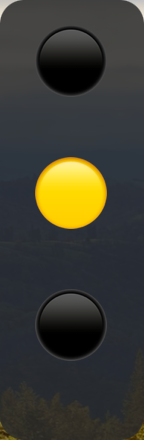

# Claude Code Traffic Light 🚦

macOS 菜单栏红绿灯，一眼看懂 Claude Code 在干嘛。[English](README_EN.md)




## 功能

| 灯 | 状态 | 说明 |
|----|------|------|
| 🟢 绿灯 | 工作中 | Claude 正在执行 |
| 🟡 黄灯闪烁 | 等确认 | 需要你去授权 |
| 🔴 红灯 | 已结束 | Claude 空闲 |

- **浮动图钉** — 始终置顶的悬浮窗，全屏也能看到；双击跳回终端
- **多项目** — 同时跑多个 Claude Code 会话，菜单切换
- **自动配置** — 启动时注入 hooks，退出时自动还原，不动你原有配置

## 安装

从 [Releases](https://github.com/DemoJj/claude-code-traffic-light/releases) 下载 `.dmg` 或 `.app.zip`，拖进 Applications 即可。

或者从源码运行：

```bash
git clone https://github.com/DemoJj/claude-code-traffic-light.git
cd claude-code-traffic-light
pip install -r requirements.txt
python traffic_light.py
```

构建 `.app`：

```bash
bash build.sh
```

## 原理

通过 Claude Code 的 [hooks](https://docs.anthropic.com/en/docs/claude-code/hooks) 机制，在会话状态变化时写文件，app 轮询文件更新菜单栏图标。退出时自动还原配置。

## 要求

- macOS 10.15+
- Python 3.9+（仅源码运行/构建时需要）

## License

[MIT](LICENSE)

---

*Vibe coded with Claude Code*
