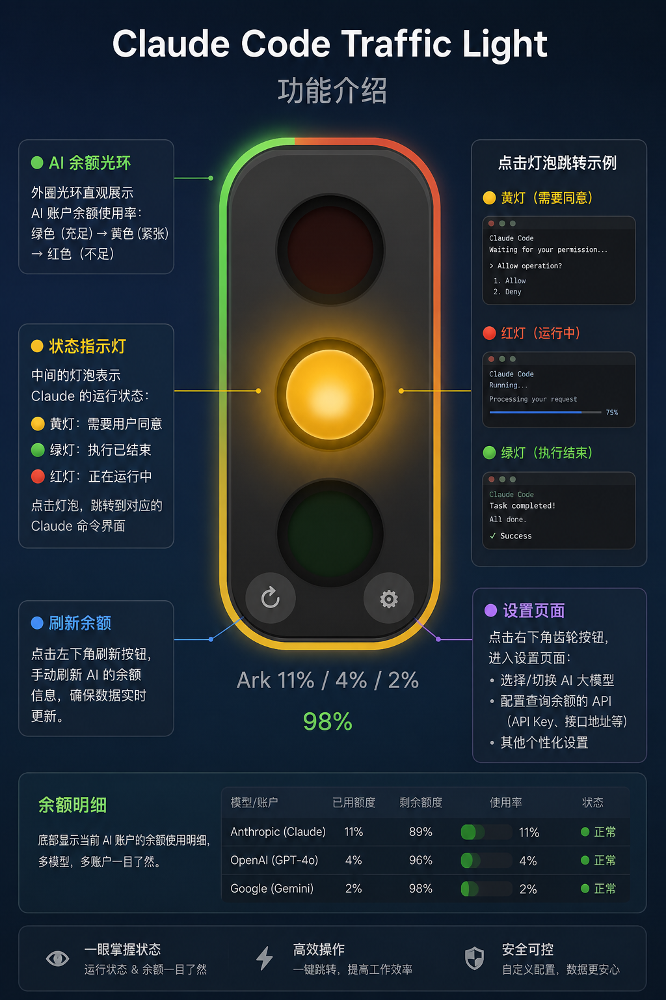
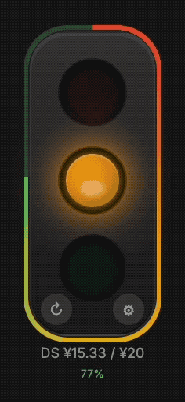
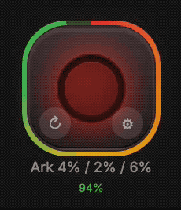

# Claude Code Traffic Light 🚦

A macOS floating traffic light that shows what Claude Code is doing at a glance. [中文](README.md)




## Demos

### Traffic light state switching (1)



### Traffic light state switching (2)



## Light Meanings

| Light | Status | Description |
|-------|--------|-------------|
| 🔴 Red breathing | Busy | Claude is processing / calling tools |
| 🟡 Yellow blinking | Waiting | Claude is asking you a question |
| 🟢 Green steady | Done | Claude finished, waiting for your input |

## Features

- **Always on top** — Electron window stays on top, visible in fullscreen / across desktops
- **Polished UI** — CSS traffic light with breathing / pulse / ring animations, dark / light themes
- **AI balance ring** — Apple Watch style gradient ring (red → orange → yellow → green) showing DeepSeek API balance ratio
- **Volcengine Coding Plan usage** — integrates Volcengine Ark `GetCodingPlanUsage` API, showing session / weekly / monthly quota usage percentages and reset times for Claude Code plans
- **Sound cues** — Web Audio synthesized tones, muteable
- **Multi-project** — run multiple Claude Code sessions, auto-switch; tray menu for manual selection
- **Click to jump** — click the light to jump to the project's IDE window (VSCode / Cursor / Windsurf, etc.)
- **Auto cleanup** — sessions removed from project list after closing
- **Auto detect** — detects running Claude Code sessions on startup
- **Auto config** — injects hooks on startup, no manual setup needed
- **Draggable window** — drag anywhere on screen, position is remembered

## Install

Download `.dmg` from [Releases](https://github.com/SunXinFei/claude-code-traffic-light/releases), drag to Applications.

## Development

```bash
npm install
npm run dev
```

## Build

```bash
# macOS
npm run dist

# Windows (run on Windows)
npm run dist:win
```

## How It Works

Uses Claude Code [hooks](https://docs.anthropic.com/en/docs/claude-code/hooks) to write state to a file on session events; the Electron main process polls the file to update the UI.

- **Red**: triggered when user submits a question / Claude calls a tool
- **Yellow**: triggered on `AskUserQuestion` (Claude asking you)
- **Green**: triggered on `Stop` / `StopFailure` (Claude finished, including early exit)
- **Jump**: identifies host app via hook env vars, locates the project window via IDE CLI
- **Cleanup**: `SessionEnd` hook removes project files when the session closes

## AI Balance Ring

A Apple Watch activity-ring style gradient ring around the light, showing the usage ratio of the currently active provider. Two providers, mutually exclusive:

### DeepSeek (cash balance)

- **Gradient**: red → orange → yellow → green; lower balance shifts to red
- **Ratio**: `current balance / manual budget`; falls back to topped-up balance when no budget set
- **API Key**: reads `DEEPSEEK_API_KEY` env var first, or configure in the settings popup
- **Settings popup**: click the balance text below the light, or the "AI Settings" button in the settings panel

### Volcengine Ark · Claude Code Coding Plan (quota)

Shows the three-tier quota usage percentages of the Claude Code plan:

| Level | Meaning | Source |
|-------|---------|--------|
| Session | Current session usage | `QuotaUsage[Level=session]` |
| Weekly | Last 1 week cumulative | `QuotaUsage[Level=weekly]` |
| Monthly | Last 1 month cumulative | `QuotaUsage[Level=monthly]` |

- **Outer ring ratio**: `1 - monthly.percent / 100` (monthly remaining; more usage → emptier ring)
- **Main window caption**: `Ark 2%/0%/5%` (session / weekly / monthly)
- **Tooltip**: full three-tier percentages + monthly remaining
- **Settings cards**: each tier shows used percentage, remaining percentage, relative reset time (e.g. `6d07h07m until reset`)
- **Auth**: Volcengine IAM Access Key ID + Secret Access Key (long-term keys)
  - Reads `VOLC_AK` / `VOLC_SK` env vars first, or configure in the settings popup
  - AK/SK stored as an object under the `volcengine` field of `~/.claude/traffic_light/api_keys.json`
- **Signing**: HMAC-SHA256 presigned URL, host signed, body unsigned (`X-NotSignBody=1`); see `electron/volcSign.cjs`
- **Endpoint**: `POST https://ark.cn-beijing.volcengineapi.com?Action=GetCodingPlanUsage&Version=2024-01-01`
- **Refresh**: fetched once on startup, then every hour; manual "refresh usage" button in the settings popup

## Requirements

- macOS 12+
- Node.js 18+ (only for development / build)

## License

[MIT](LICENSE)

---

*Vibe coded with Claude Code*
